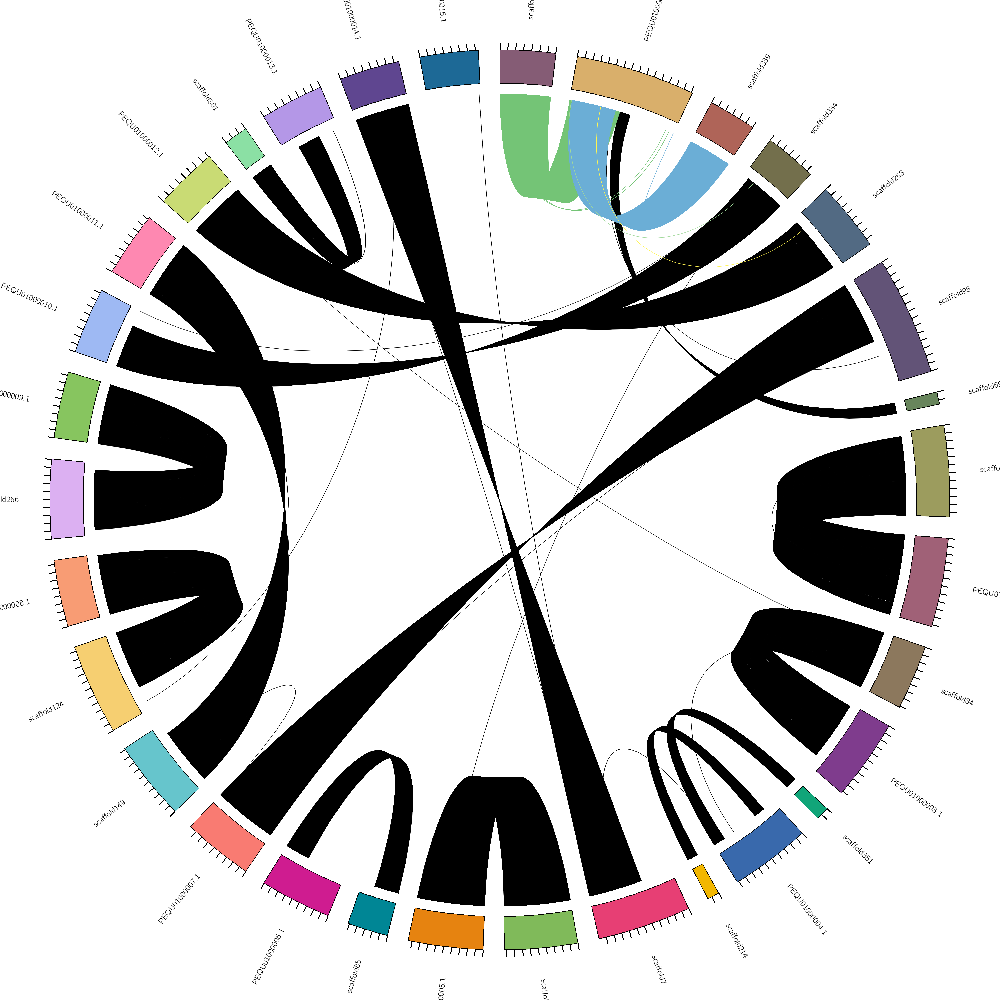
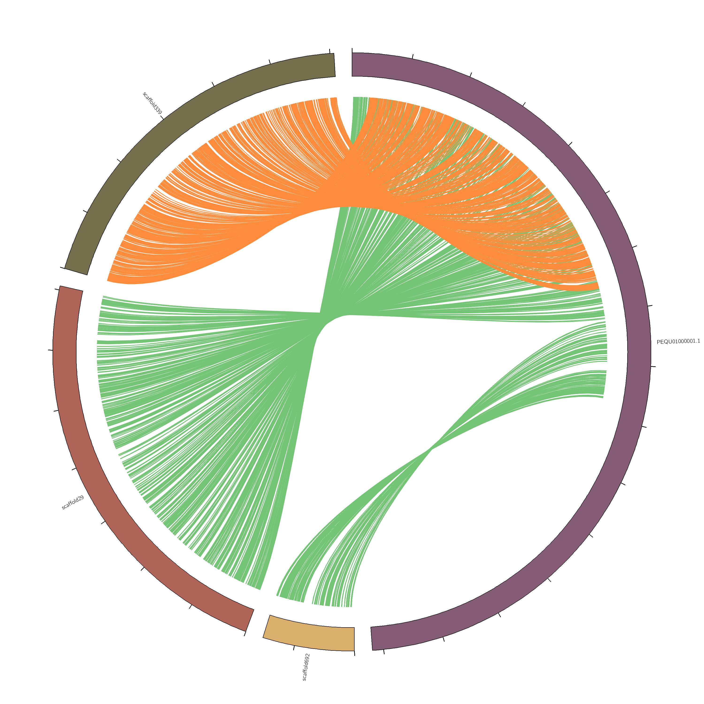

### synteny

基因组共线性是用来描述遗传位点在相同的染色体上有着相同的物理位置。而目前随着基因组测序的普遍，在获得一个基因组组装之后，常见的一个分析就是跟较近缘的物种进行共线性分析，一方面是为了衡量基因组组装的完整性，另一方面可以反应两个物种间的差异。

### 分析方法

共线性的关系其实主要还是靠系列的相似性得来的，所以核心思想还是比对，目前可以使用的软件很多，这里不再赘述他们的具体使用。一般用到数据是两个基因组的蛋白序列，或者全基因组的组装结果，针对这两种不同的数据，一般用到的方法比对方法是blastp和lastz，最后比对结果经过进一步的处理之后得到一个table表，每一行表示一个共线性的block块。


### 可视化策略

前面只是大概提了一下共线性的思想和分析方法，下面主要介绍一下如何将这些比对结果展示出来，这里都是我个人总结和实现的方法，是应用到平常项目当中的，最主要的特点是自动化配色和生成circos画图所需要的配置文件。但是真正发表文章还需要自己根据实际情况合理的选择，并调整画图的参数。

>Note: 以下的分析中参考序列不论有没有组装到染色体级别都可以相应的代码，只有文件按照要去就可以。另外一下每个脚本都会生成一个```karyotype.txt```和```link.txt```的文件，circos.conf文件中已经指定了输入文件是这两个文件，所以可以直接使用该配置文件画图

1. target基因组和reference基因组one by one的画在一张图中，可以想象一个block的比对记录，有target和ref两条序列，这俩个会挨着画在一起，

```shell
python3 ../bin/preCircosLink.py --link test.link --scaf_len all.lens
circos -conf circos.conf
```
2. 如果你的reference是已经组装到染色体级别，这时候你可以选择将每个染色体单独拿出来画一张图，这样比较清晰的看到每个染色体的情况，

```shell
python3 ../bin/split_blocks_by_Chrs.py test.link
```
此时会生成一个```linkbyChrs```的文件夹，这个文件下会有每个染色体的link文件，这是可以使用方法1中的脚本画图：
e.g.

```shell
cd linkbyChrs/PEQU01000001.1
python3 ../../../bin/preCircosLink.py --link PEQU01000001.1.txt --scaf_len ../../all.lens
circos -conf ../../circos.conf
```
3. 如果两个基因组都是scaffold级别，想要看整体的比对情况，这时候可以不考虑单个scaffold的情况，所以可以将两个染色体分别连城两个假染色体，但这个可能需要进行适当的过滤才能看清block的关系，不然所以线条都会铺满整个图片。

```shell```
python3 ../bin/artificial_chrs_for_synteny.py querry.lens ref.lens test.link 10000000 10000
circos -conf circos.conf
```
其中1000000是过滤掉scaffold长度小于1M的，10000是过滤掉block长度小于10K的
